# Exemple : Traçabilité du Café - De la Ferme à la Tasse ☕

**ProcessMetaLanguage en Action**

Cet exemple montre comment modéliser la supply chain complète du café, depuis la récolte jusqu'à la consommation, en utilisant ProcessMetaLanguage et les standards EPCIS 2.0.

---

## Vue d'Ensemble du Processus

```mermaid
graph LR
    A[Grains Verts] -->|harvesting| B[Récoltés]
    B -->|drying| C[Séchés]
    C -->|storing| D[Stockés Ferme]
    D -->|shipping| E[En Transit Export]
    E -->|receiving| F[Arrivés Torréfacteur]
    F -->|roasting| G[Torréfiés]
    G -->|packing| H[Emballés]
    H -->|retail_selling| I[Vendus]
```



---

## Étape 1 : À la Ferme 🌱

### Objets Créés

```yaml
# Lot de Café Vert
object:
  name: "Lot-Arabica-2024-001"
  type: "raw_material"
  properties:
    variety: "Arabica Bourbon"
    farm: "Finca El Salvador"
    altitude: "1,500m"
    harvest_date: "2024-03-15"
    quantity: "500kg"
```

### États et Actions

#### 1. Récolte
```yaml
state:
  disposition: "harvested"
  location: "Finca El Salvador - Parcelle Nord"
  
action_principale:
  type: "expose_data"
  data: ["variety", "altitude", "harvest_date"]
  
action_secondaire:
  businessStep: "harvesting"
  captures:
    - picker_id
    - weather_conditions
    - ripeness_percentage
  transition: "drying_required"
```

#### 2. Séchage
```yaml
state:
  disposition: "in_progress"
  process: "sun_drying"
  
actions:
  - businessStep: "drying"
    duration: "14 days"
    captures:
      - moisture_level
      - temperature_avg
    transition: "dried"
```

#### 3. Stockage Ferme
```yaml
state:
  disposition: "stored"
  location: "Farm Warehouse A"
  
actions:
  - businessStep: "storing"
    captures:
      - storage_conditions
      - bag_numbers
    generates:
      - lot_certificate
```

---

## Étape 2 : Export et Transport 🚢

### Transformation en Container

```yaml
# Agrégation dans container
object:
  name: "Container-MSKU-789456"
  type: "container"
  contains:
    - "Lot-Arabica-2024-001"
    - "Lot-Arabica-2024-002"
    - "Lot-Arabica-2024-003"
```

### États Transport

```yaml
states:
  - disposition: "in_transit"
    carrier: "Maersk Line"
    actions:
      - businessStep: "shipping"
        from: "Port Santos, Brazil"
        to: "Port Hamburg, Germany"
        captures:
          - bill_of_lading
          - container_temperature
          - GPS_tracking
          
  - disposition: "arrived"
    location: "Hamburg Customs"
    actions:
      - businessStep: "inspecting"
        authority: "EU Customs"
        validates:
          - phytosanitary_certificate
          - origin_certificate
```

---

## Étape 3 : Torréfaction 🔥

### Réception Torréfacteur

```yaml
object:
  name: "Reception-Batch-2024-089"
  source: "Container-MSKU-789456"
  
state:
  disposition: "received"
  location: "Roastery Warehouse"
  
actions:
  - businessStep: "receiving"
    validates:
      - moisture_content: "< 12%"
      - defects_count: "< 5%"
    captures:
      - quality_score
      - cupping_notes
```

### Process Torréfaction

```yaml
# Transformation
object:
  name: "Roasted-Batch-2024-089-A"
  source: "Lot-Arabica-2024-001"
  type: "finished_product"
  
state:
  disposition: "transformed"
  
actions:
  - businessStep: "transforming"
    subprocess: "roasting"
    parameters:
      - temperature_profile: "Medium"
      - duration: "12 minutes"
      - end_temperature: "210°C"
    captures:
      - roast_curve
      - color_value
      - moisture_final
```

---

## Étape 4 : Conditionnement et Vente 📦

### Emballage

```yaml
object:
  name: "SKU-ARABICA-250G-2024089"
  type: "consumer_unit"
  
state:
  disposition: "packed"
  
actions:
  - businessStep: "packing"
    container: "250g valve bag"
    captures:
      - packaging_date
      - best_before_date
      - batch_code
    generates:
      - QR_code_traceability
```

### Distribution Retail

```yaml
state:
  disposition: "sellable_accessible"
  location: "Store shelf - Berlin"
  
actions:
  - businessStep: "retail_selling"
    captures:
      - point_of_sale
      - transaction_id
    transition: "sold"
```

---

## Étape 5 : Consommateur Final ☕

### Traçabilité Complète via QR Code

Le consommateur scanne le QR code et accède à :

```json
{
  "product": "Arabica Premium 250g",
  "journey": {
    "farm": {
      "name": "Finca El Salvador",
      "location": "Guatemala",
      "altitude": "1,500m",
      "harvest_date": "2024-03-15",
      "farmer": "Carlos Rodriguez"
    },
    "transport": {
      "export_port": "Santos, Brazil",
      "import_port": "Hamburg, Germany", 
      "duration": "21 days",
      "carbon_footprint": "0.12 kg CO2/kg"
    },
    "roasting": {
      "date": "2024-05-10",
      "roaster": "Berlin Coffee Roasters",
      "profile": "Medium",
      "cupping_score": 85
    }
  },
  "certifications": [
    "Fair Trade",
    "Organic EU",
    "Rainforest Alliance"
  ],
  "blockchain_proof": "0x7d3f..."
}
```

---

## Implémentation ProcessMetaLanguage

### 1. Créer le Canvas

```javascript
// Dans Obsidian avec ProcessMetaLanguage
const coffeeProcess = new ProcessMap("Coffee_Traceability");

// Objets principaux
const greenBeans = coffeeProcess.createObject({
  name: "Green Coffee Beans",
  type: "raw_material"
});

const roastedBeans = coffeeProcess.createObject({
  name: "Roasted Coffee", 
  type: "finished_product"
});

const packagedCoffee = coffeeProcess.createObject({
  name: "Consumer Package",
  type: "retail_unit"
});
```

### 2. Définir les États

```javascript
// États grains verts
greenBeans.addState("harvested", {
  actions: ["harvesting", "quality_control"]
});

greenBeans.addState("dried", {
  actions: ["drying", "moisture_testing"]
});

greenBeans.addState("in_transit", {
  actions: ["shipping", "tracking"]
});

// États transformation
roastedBeans.addState("roasted", {
  actions: ["transforming", "quality_testing"]
});

// États retail
packagedCoffee.addState("on_shelf", {
  actions: ["retail_selling", "inventory_tracking"]
});
```

### 3. Export Documentation

```bash
# Génération automatique
ProcessMetaLanguage Export → 
  ✓ Coffee_Traceability_README.md
  ✓ Coffee_API_Spec_OpenAPI.yaml
  ✓ Coffee_Compliance_EPCIS.json
  ✓ Coffee_Integration_360SC.json
```

---

## Métriques et KPIs

### Dashboard Temps Réel

```yaml
metrics:
  total_journey_time: "56 days"
  quality_score: 85/100
  carbon_footprint: "2.3 kg CO2/kg"
  farmer_premium: "+15% Fair Trade"
  
traceability:
  checkpoints: 12
  data_points: 147
  certifications: 3
  blockchain_anchors: 8
```

### Matrice de Traçabilité

| Étape | Durée | Qualité | Empreinte CO2 | Valeur Ajoutée |
|-------|-------|---------|---------------|----------------|
| Récolte | 3j | 100% | 0.1 kg | $2.50/kg |
| Séchage | 14j | 98% | 0.05 kg | $0.50/kg |
| Transport | 21j | 97% | 1.2 kg | $1.00/kg |
| Torréfaction | 1j | 95% | 0.8 kg | $5.00/kg |
| Emballage | 1j | 95% | 0.15 kg | $3.00/kg |

---

## Avantages ProcessMetaLanguage

### 1. Visualisation Claire
- Canvas graphique intuitif
- Relations visuelles évidentes
- Compréhension immédiate du flux

### 2. Conformité Automatique
- Standards EPCIS 2.0 intégrés
- Validation temps réel
- Certification ready

### 3. Documentation Complète
- README auto-généré
- API specifications
- Guides d'intégration

### 4. Évolutivité
- Ajout facile nouvelles étapes
- Modification sans refonte
- Versioning intégré

---

## Code Complet

Le processus complet est disponible :
- **Canvas Excalidraw** : `Coffee_Traceability.excalidraw`
- **Documentation** : `Coffee_Traceability_Docs/`
- **API Specs** : `Coffee_API_v1.0.yaml`
- **Tests** : `Coffee_Tests_Suite/`

---

## Conclusion

Cet exemple montre comment ProcessMetaLanguage permet de :
- ✅ Modéliser une supply chain complexe visuellement
- ✅ Générer documentation et APIs automatiquement
- ✅ Assurer conformité EPCIS 2.0
- ✅ Fournir traçabilité bout-en-bout

**De la ferme à la tasse, chaque grain est tracé !** ☕🔍

---

*Exemple ProcessMetaLanguage - Traçabilité Café*  
*Version 1.0.0 - 2025*